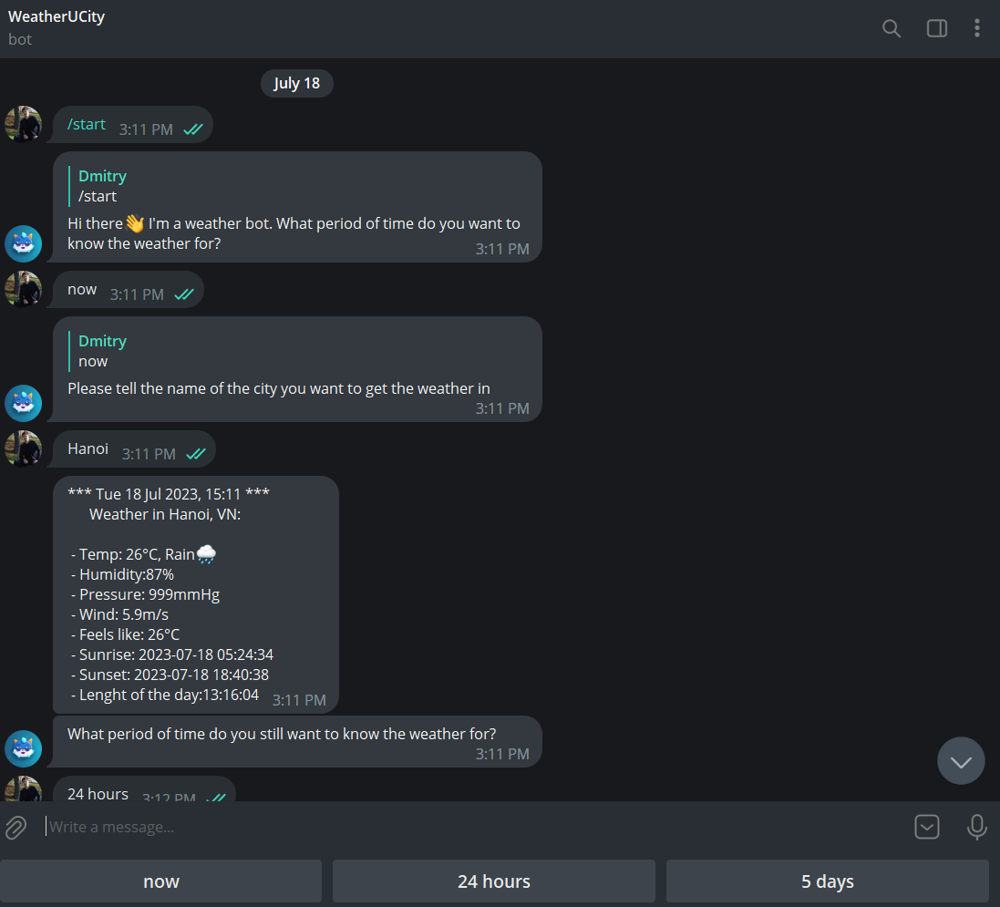

About The Project 

Functional:
A telegram weather bot that displays weather information of a given city from the site https://openweathermap.org/.

You can check the weather for the following periods:
- at the moment (now);
- for the next 24 hours (24 hours);
- for the next 5 days (5 days).

Resources and APIs
- Python 3.9.13
- requests
- datetime
- aiogram
- OpenWeatherMap API
- Telegram Bot API

Within the project folder, you will find the 'main.py', 'weather_def.py', and 'config.py' files, which are the main components of the project.
- main.py contains the code to start the Telegram bot and process user commands;
- weather_def.py contains functions for calling the OPENWEATHER API and getting weather data;
- config.py contains YOUR unique OPENWEATHER API and Telegram bot token .

How to set up:

1) Create a Telegram bot and grab the token.
- Enter @Botfather in Telegram or click [here](https://t.me/botfather);
- Click “Start” to activate BotFather bot;
- Choose or type the /newbot command and send it;
- Choose a name and a unique username for your bot;
- Choose or send the command /token;
- Grab your token.

2) We are going to use [OpenWeatherMap API](https://openweathermap.org/api), which requires an API key. You can get one for free by logging in to their website.

3) Open the config.py file and replace your BOT_TOKEN and OPEN_WEATHER_MAP_API_KEY.

4) Before running the bot, you will need to install all the requirement libraries through the command line or terminal using these commands:
- pip install requests 
- pip install aiogram
5) You've done, enjoy this bot!